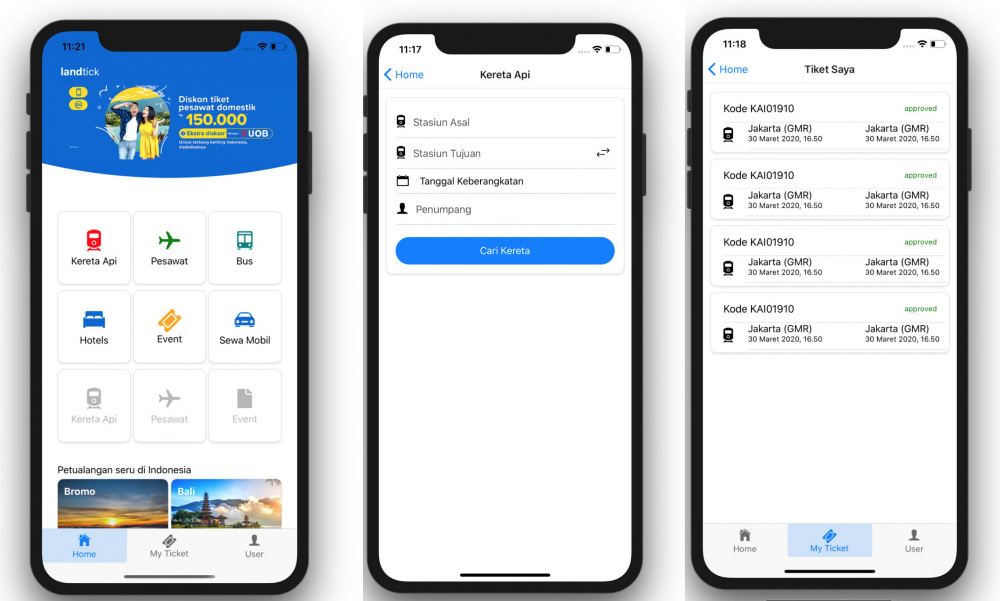

# Landtick Mobile

Online ticket booking application. Book tickets anytime, anywhere.

## Table of Contents

- [Getting Started](#getting-started)
  - [Prerequisites](#prerequisites)
  - [Installation](#installation)
  - [Setup](#setup)
- [Screenshots](#screenshots)
- [Built With](#built-with)
- [Author](#author)
- [License](#license)

## Getting Started

Before starting to install the project, there're some things that need to be done first.

### Prerequisites

Make sure all of these are properly installed in your system.

| Application  | Download                                                                                                                      |
| ------------ | ----------------------------------------------------------------------------------------------------------------------------- |
| Git          | [Windows](https://gitforwindows.org/) / [Linux](https://git-scm.com/download/linux) / [Mac](https://git-scm.com/download/mac) |
| React Native | [Link](https://reactnative.dev/)                                                                                              |

### Installation

First, clone this repository into your system.

```
git clone https://github.com/setyawanandik/Landtick_RN.git
```

Then, install all the packages that described in `package.json`.

```
npm install
```

### Setup

Then, run the web application.

`npm run start`

Wait till the application is opened into your device. Now, you can explore Landtick and its features. Enjoy!

## Screenshots



## Built With

- [React Native](https://reactnative.dev/)
- [Native Base](https://nativebase.io/)

## Author

**Andik Setyawan** - [setyawanandik](https://github.com/setyawanandik)

## License

This project is licensed under the GNU General Public v3.0 License - see the [LICENSE](LICENSE) file for details
